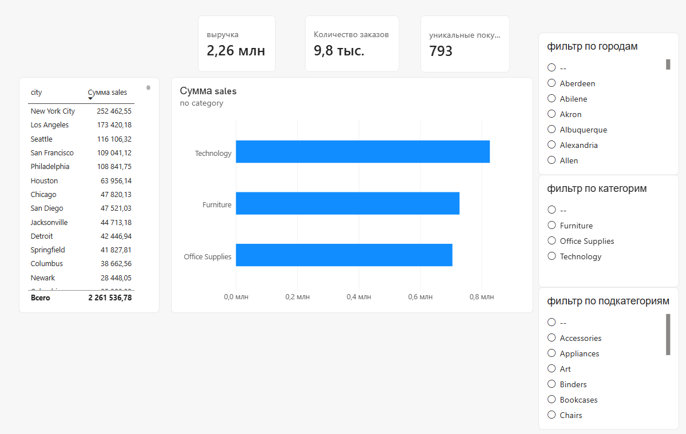

# Superstore Analytics Project

Полный цикл аналитического проекта: от сырых данных до интерактивного дашборда.

## О проекте

Этот проект ставил своей задачей прохождение полного цикла работы с данными:
- Развертывание PostgreSQL в Docker
- Загрузка и очистка данных
- Построение схемы "Звезда" (Star Schema)
- Создание интерактивного дашборда в Power BI

Датасет — **Superstore Sales Dataset**.

---

## Архитектура


Хранилище данных | PostgreSQL 16 
Оркестрация | Docker / Docker Compose 
Визуализация | Power BI Desktop (DirectQuery) 
Модель данных | Star Schema (факты + измерения) 

---

## Модель данных

Схема "Звезда" состоит из:
- **Факты:** `res` (sales, quantity, profit)
- **Измерения:**
  - `dim_city` (география: город, штат, регион, страна)
  - `dim_customer` (клиенты: ID, имя, сегмент)
  - `dim_product_category` (категории и подкатегории)

Все связи реализованы через числовые ID для производительности.

---

---

## Как запустить проект

### 1. Клонировать репозиторий
```bash
git clone https://github.com/your-username/superstore-analytics.git
cd superstore-analytics
```
### 2. Поднять postgresql через docker
```
docker-compose up -d
```
### 3. Применить схему базы данных
```
docker cp schema.sql postgres_superstore:/tmp/schema.sql
docker exec -it postgres_superstore psql -U postgres -d superstore -f /tmp/schema.sql
```
### 4. Открыть файл с дашбордом

## Используемые технологии
PostgreSQL 16
Docker / Docker Compose
WSL2 (Windows)
Power BI Desktop (DirectQuery)
DAX (базовые меры)

### Автор
Артеменко Пётр, студент ТюмГУ
